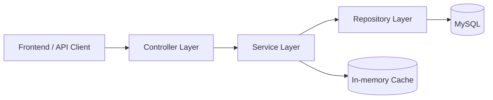
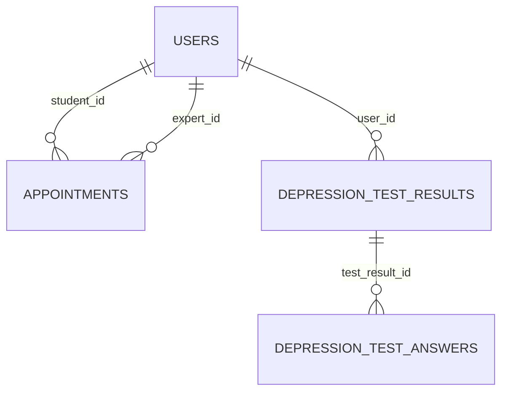

# MindMeter

[](https://reactjs.org/)
[](https://spring.io/projects/spring-boot)
[](https://www.oracle.com/java/)
[](https://www.mysql.com/)

MindMeter is a full-stack mental health platform. This README is intentionally backend-focused to show system design decisions, trade-offs, and implementation details.

## Architecture

- **Layered architecture**: `Controller -> Service -> Repository -> MySQL`.
- **API style**: RESTful endpoints with Spring MVC and DTO-based response models.
- **Security**: JWT authentication integrated into Spring Security filter chain.
- **Role model**: RBAC with `ADMIN`, `EXPERT`, `STUDENT`, and `ANONYMOUS`.
- **Data access**: Spring Data JPA/Hibernate with explicit SQL schema in `database/MindMeter.sql`.



## Key Technical Decisions

- **JWT-centered API auth**: authentication state is carried in signed tokens and validated by filter-based security middleware.
- **Token refresh endpoints per role context**: system regenerates JWT with latest user/plan data after profile or plan updates.
- **Service-level caching for read-heavy modules**: `@Cacheable` on blog lists/categories/tags to reduce repeated DB reads.
- **Pagination-first design**: `Pageable`/`Page` is used for large collections (blog/forum/admin listing) to control payload size.
- **Anonymous-to-registered upgrade flow**: supports low-friction onboarding, then upgrades to persistent account with secure password hashing.
- **Strict role-based authorization**: endpoint access split by role at security config level to limit privilege scope.

## Authentication Flow

1. Client calls `POST /api/auth/login` with email/password.
2. Backend authenticates via `AuthenticationManager`.
3. Backend issues JWT containing role and user claims.
4. Client sends JWT in `Authorization: Bearer <token>` for protected APIs.
5. JWT is validated by `JwtAuthenticationFilter` before controller access.
6. For role-specific refresh endpoints, backend reissues a new JWT from current user data.

## Database Design

### Core entities

- `users`: identity, role, status, subscription plan, OAuth provider, and audit timestamps.
- `appointments`: links student and expert users, stores schedule, status, consultation type, and notes.
- `depression_test_results`: per-user test outcomes with severity and diagnosis metadata.
- `depression_test_answers`: normalized answers linked to each test result.
- `expert_schedules`: availability windows for experts.

### Key relationships

- One `User` (student) -> many `Appointment`.
- One `User` (expert) -> many `Appointment`.
- One `User` -> many `DepressionTestResult`.
- One `DepressionTestResult` -> many `DepressionTestAnswer`.



## Performance Optimization

- **Connection pooling**: HikariCP is configured for stable DB throughput under concurrency.
- **Read caching**: in-memory cache manager + `@Cacheable` for frequently accessed blog metadata and list queries.
- **Indexing strategy**: schema includes targeted indexes on scheduling and lookup columns (e.g. `appointment_date`, `student_id`, `expert_id`, `status`).
- **Bounded payloads**: paginated endpoints reduce transfer size and memory pressure in list APIs.

## API Example

### Login

`POST /api/auth/login`

Request:

```json
{
  "email": "student1@mindmeter.com",
  "password": "your_password"
}
```

Response (simplified):

```json
{
  "token": "eyJhbGciOiJIUzI1NiIs...",
  "email": "student1@mindmeter.com",
  "role": "STUDENT",
  "user": {
    "id": 1,
    "plan": "FREE"
  }
}
```

## Tech Stack

- **Backend**: Spring Boot, Spring Security, Spring Data JPA, Java 17, MySQL, JWT, Maven.
- **Frontend**: React, Tailwind CSS, React Router, Axios.
- **Tooling**: Postman, Git.

## Project Structure

```text
MindMeter/
├── backend/
│   ├── src/main/java/com/shop/backend/
│   │   ├── controller/
│   │   ├── service/
│   │   ├── repository/
│   │   ├── model/
│   │   ├── security/
│   │   └── config/
│   └── src/test/java/
├── frontend/
├── database/
│   └── MindMeter.sql
└── README.md
```

## How To Run

### Prerequisites

- Java 17+
- Node.js 18+
- MySQL 8+
- Maven 3.8+

### Backend

```bash
cd backend
cp src/main/resources/application.properties.example src/main/resources/application.properties
mvn clean install
mvn spring-boot:run
```

Backend runs at `http://localhost:8080`.

### Frontend

```bash
cd frontend
npm install
npm start
```

Frontend runs at `http://localhost:3000`.

### Database

```sql
CREATE DATABASE mindmeter;
```

Then import:

```bash
mysql -u root -p mindmeter < database/MindMeter.sql
```

## Testing

```bash
cd backend
mvn test
```

## License

This project is licensed under the Apache License 2.0. See `LICENSE`.
